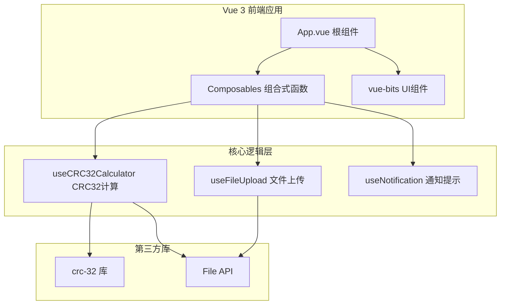
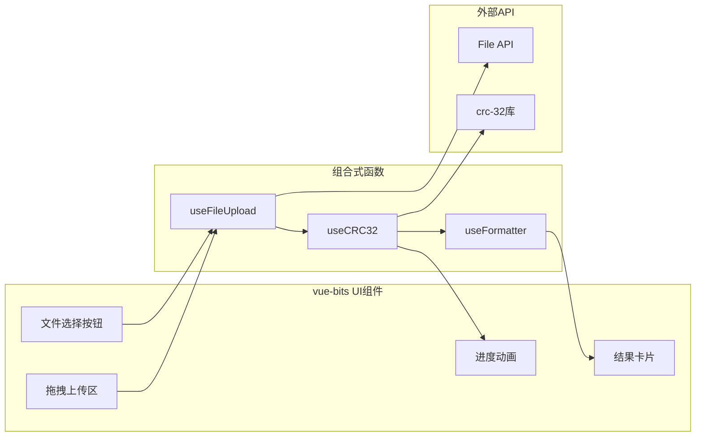
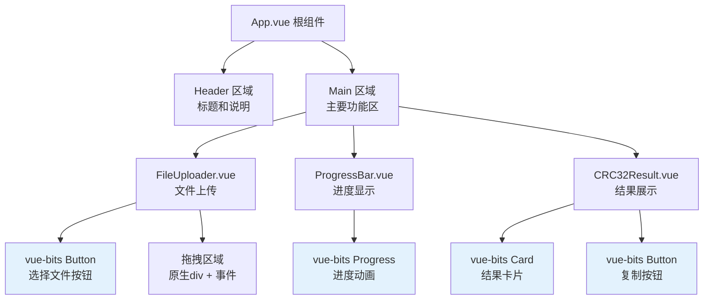
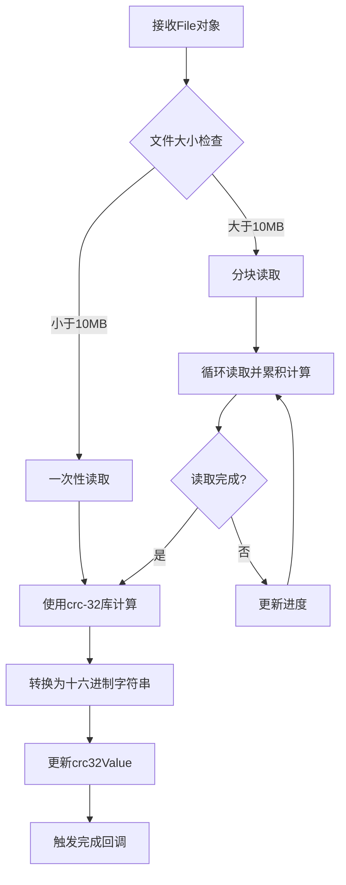
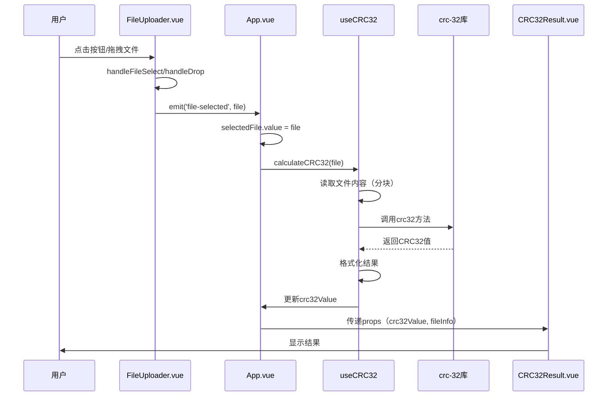
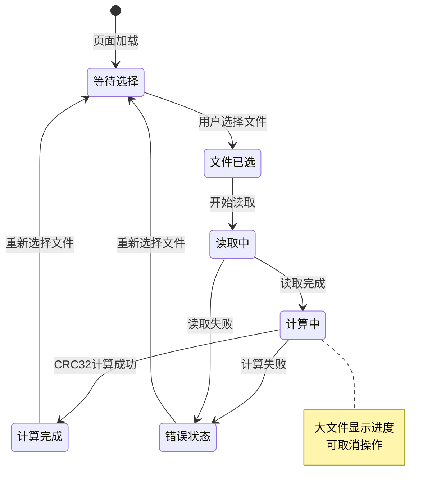
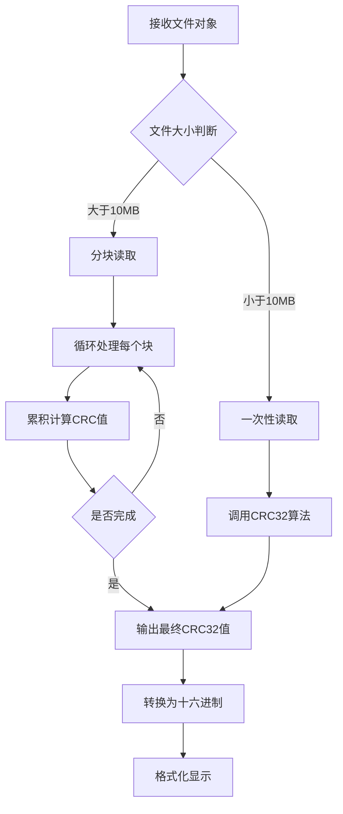
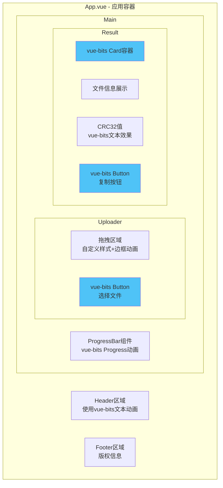
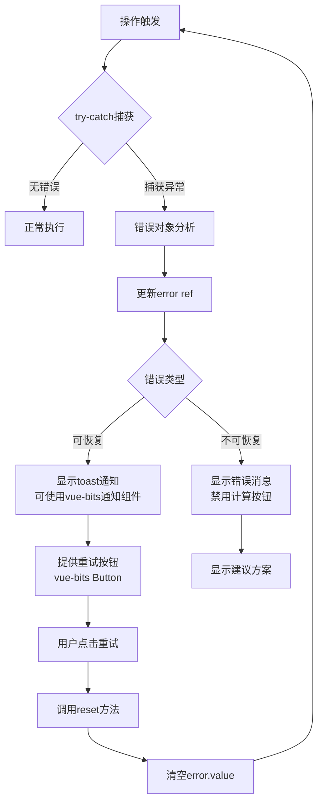
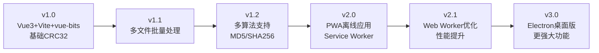

# 文件CRC32计算器 - 设计文档

## 1. 概述

### 1.1 项目目标
开发一个纯前端网页应用，允许用户选择本地文件并计算其CRC32校验值，结果直接显示在网页上。

### 1.2 核心价值
- **离线隐私**：所有计算在浏览器端完成，文件不上传到服务器，保护用户隐私
- **即时反馈**：选择文件后立即计算并显示结果
- **易用性**：简洁直观的用户界面，无需安装额外软件

### 1.3 技术定位
- 基于 Vue 3 + Vite 的现代前端应用
- 使用 vue-bits 组件库提供动画UI组件
- 基于浏览器 File API 进行文件读取
- 使用 CRC32 JavaScript 库进行校验值计算

## 2. 技术栈

| 技术类型 | 选型方案 | 说明 |
|---------|---------|------|
| 前端框架 | Vue 3 | 使用 Composition API 开发 |
| 构建工具 | Vite | 快速的开发服务器和优化的生产构建 |
| UI组件库 | vue-bits | 提供动画UI组件，增强视觉效果 |
| 样式方案 | CSS3 + vue-bits 内置样式 | 结合组件库样式和自定义样式 |
| CRC32库 | crc-32 (npm) | 成熟可靠的CRC32实现 |
| 文件处理 | File API + FileReader | 浏览器原生API |
| 状态管理 | Vue Composition API (ref/reactive) | 轻量级状态管理 |
| 包管理器 | npm / pnpm / yarn | 依赖管理 |

## 3. 架构设计

### 3.1 整体架构



### 3.2 项目目录结构

```
hash/
├── public/              # 静态资源
├── src/
│   ├── components/      # Vue组件
│   │   ├── FileUploader.vue      # 文件上传组件
│   │   ├── CRC32Result.vue       # 结果展示组件
│   │   └── ProgressBar.vue       # 进度条组件
│   ├── composables/     # 组合式函数
│   │   ├── useFileUpload.js      # 文件上传逻辑
│   │   ├── useCRC32.js           # CRC32计算逻辑
│   │   └── useFormatter.js       # 格式化工具
│   ├── utils/           # 工具函数
│   │   ├── fileReader.js         # 文件读取工具
│   │   └── validators.js         # 验证函数
│   ├── App.vue          # 根组件
│   ├── main.js          # 入口文件
│   └── style.css        # 全局样式
├── package.json
├── vite.config.js       # Vite配置
└── index.html
```

### 3.3 数据流架构



## 4. 组件架构

### 4.1 Vue组件定义

| 组件名称 | 文件路径 | 职责描述 | 关键功能 |
|---------|---------|---------|---------|
| App.vue | src/App.vue | 应用根组件 | 整体布局、状态管理、组件协调 |
| FileUploader.vue | src/components/FileUploader.vue | 文件上传组件 | 文件选择、拖拽上传、使用vue-bits按钮 |
| CRC32Result.vue | src/components/CRC32Result.vue | 结果展示组件 | 展示CRC32值和文件信息、复制功能 |
| ProgressBar.vue | src/components/ProgressBar.vue | 进度显示组件 | 展示计算进度、使用vue-bits动画 |

### 4.2 Vue组件层次结构



### 4.3 组件状态管理（Vue 3 Composition API）

| 组件 | 响应式状态 | 数据类型 | 定义方式 | 说明 |
|-----|---------|---------|---------|------|
| App.vue | selectedFile | Ref&lt;File \| null&gt; | ref(null) | 当前选中的文件 |
| App.vue | crc32Value | Ref&lt;string&gt; | ref('') | 计算得到的CRC32值 |
| App.vue | isCalculating | Ref&lt;boolean&gt; | ref(false) | 是否正在计算 |
| App.vue | progress | Ref&lt;number&gt; | ref(0) | 计算进度 (0-100) |
| App.vue | error | Ref&lt;string&gt; | ref('') | 错误信息 |
| FileUploader.vue | isDragging | Ref&lt;boolean&gt; | ref(false) | 拖拽状态 |
| CRC32Result.vue | fileInfo | Computed | computed() | 从selectedFile派生的文件信息 |
| CRC32Result.vue | copyStatus | Ref&lt;string&gt; | ref('') | 复制状态提示 |

## 5. Composables 设计（组合式函数）

### 5.1 useFileUpload 组合式函数

**功能描述**：封装文件上传相关的逻辑

**导出接口**：

| 导出项 | 类型 | 说明 |
|-------|------|------|
| selectedFile | Ref&lt;File \| null&gt; | 当前选中的文件 |
| isDragging | Ref&lt;boolean&gt; | 拖拽状态 |
| handleFileSelect | Function | 处理文件选择事件 |
| handleDrop | Function | 处理文件拖放 |
| handleDragOver | Function | 处理拖拽悬停 |
| handleDragLeave | Function | 处理拖拽离开 |
| clearFile | Function | 清除选中的文件 |

**内部逻辑**：
- 验证文件对象有效性
- 处理拖拽交互状态
- 限制文件大小（可配置）
- 触发文件变化事件

### 5.2 useCRC32 组合式函数

**功能描述**：封装CRC32计算逻辑

**导出接口**：

| 导出项 | 类型 | 说明 |
|-------|------|------|
| crc32Value | Ref&lt;string&gt; | CRC32计算结果（十六进制） |
| isCalculating | Ref&lt;boolean&gt; | 是否正在计算 |
| progress | Ref&lt;number&gt; | 计算进度百分比 |
| error | Ref&lt;string&gt; | 错误信息 |
| calculateCRC32 | Function | 执行CRC32计算 |
| reset | Function | 重置状态 |

**计算逻辑**：


### 5.3 useFormatter 组合式函数

**功能描述**：提供格式化工具函数

**导出接口**：

| 导出项 | 类型 | 说明 |
|-------|------|------|
| formatFileSize | Function | 格式化文件大小（字节转KB/MB/GB） |
| formatCRC32 | Function | 格式化CRC32值（添加前缀、大小写） |
| formatDuration | Function | 格式化时间（毫秒转可读格式） |
| copyToClipboard | Function | 复制文本到剪贴板 |

## 6. 数据流设计

### 6.1 文件处理流程



### 6.2 Vue应用状态转换流程



## 7. 核心功能设计

### 7.1 文件选择功能（FileUploader.vue）

**功能描述**：使用 vue-bits 按钮组件和原生拖拽事件实现文件选择

**vue-bits 组件使用**：
- 使用 vue-bits 的 Button 组件作为文件选择触发器
- 配置按钮动画效果增强交互体验
- 可自定义按钮样式、大小和颜色

**实现方式**：

| 交互方式 | 触发条件 | 行为描述 |
|---------|---------|---------|
| 点击选择 | 用户点击"选择文件"按钮 | 打开系统文件选择对话框 |
| 拖拽上传 | 用户拖拽文件到指定区域 | 捕获drop事件并获取文件对象 |

**输入验证规则**：

| 验证项 | 规则 | 错误提示 |
|-------|------|---------|
| 文件存在性 | 必须选择至少一个文件 | "请选择要计算的文件" |
| 文件大小 | 建议限制在2GB以内 | "文件过大，可能导致浏览器卡顿" |
| 文件数量 | 一次只处理一个文件 | "请单独选择文件进行计算" |

### 7.2 CRC32计算功能（useCRC32.js）

**功能描述**：使用 crc-32 npm 包对文件内容进行CRC32校验值计算

**依赖安装**：
```
npm install crc-32
```

**核心实现思路**：
- 在 useCRC32 组合式函数中封装计算逻辑
- 使用 FileReader API 读取文件内容为 ArrayBuffer
- 调用 crc-32 库的方法计算校验值
- 使用 ref 和 reactive 管理计算状态

**计算策略**：



**分块处理参数**：

| 参数 | 值 | 说明 |
|-----|---|------|
| 块大小 | 2MB (2 * 1024 * 1024 bytes) | 平衡性能与内存占用 |
| 读取方式 | ArrayBuffer | 适合二进制数据处理 |
| 进度更新频率 | 每处理一个块更新一次 | 提供实时反馈 |

**算法实现方案**：

| 方案 | 优点 | 缺点 | 推荐场景 |
|-----|------|------|---------|
| 使用crc-32库 | 准确可靠，经过测试 | 需要引入外部依赖 | 生产环境 |
| 自实现算法 | 无外部依赖 | 需要充分测试验证 | 学习或极简场景 |

### 7.3 结果展示功能（CRC32Result.vue）

**功能描述**：使用 vue-bits 的卡片或动画组件展示计算结果

**vue-bits 组件应用**：
- 使用 vue-bits 的 Card 或相关容器组件展示结果
- 使用 vue-bits 的文本动画效果展示 CRC32 值
- 使用 vue-bits 的 Button 组件实现复制功能
- 添加淡入淡出或滑动动画效果

**展示内容**：

| 信息项 | 数据来源 | 格式示例 |
|-------|---------|---------|
| 文件名 | File.name | "document.pdf" |
| 文件大小 | File.size | "2.5 MB" |
| 文件类型 | File.type | "application/pdf" |
| CRC32值（十六进制） | 计算结果 | "A1B2C3D4" |
| CRC32值（十进制） | 计算结果 | "2712847316" |
| 计算耗时 | 性能统计 | "125 ms" |

**交互功能**：

| 功能 | 触发方式 | 行为 |
|-----|---------|------|
| 复制CRC32值 | 点击复制按钮 | 将CRC32值复制到剪贴板 |
| 重新计算 | 点击"重新选择"按钮 | 清空结果，返回文件选择状态 |
| 结果高亮 | 鼠标悬停 | CRC32值区域高亮显示 |

## 8. 用户界面设计

### 8.1 页面布局结构（基于 vue-bits 组件）



### 8.2 界面状态设计

| 状态 | 显示内容 | 交互元素 |
|-----|---------|---------|
| 初始状态 | 拖拽区域提示文字 + 选择按钮 | 文件选择按钮可点击 |
| 拖拽悬停 | 拖拽区域高亮显示 | 提示"松开鼠标上传文件" |
| 计算中 | 进度条 + 百分比 | 取消按钮（可选） |
| 计算完成 | 文件信息 + CRC32结果 | 复制按钮 + 重新选择按钮 |
| 错误状态 | 错误提示信息 | 重试按钮 |

### 8.3 样式设计方向（结合 vue-bits）

| 设计元素 | 设计原则 | vue-bits 应用 |
|---------|---------|-------------|
| 配色方案 | 简洁明快，主色调为蓝色或绿色 | 使用 vue-bits 组件的颜色配置选项 |
| 动画效果 | 平滑的过渡和交互动画 | 使用 vue-bits 提供的动画组件和效果 |
| 排版布局 | 居中对齐，垂直布局，移动端友好 | Flexbox + CSS Grid |
| 交互反馈 | 悬停、点击、加载状态 | vue-bits 按钮和进度组件自带动画 |
| 响应式设计 | 适配多种屏幕尺寸 | CSS媒体查询 + vue-bits 响应式组件 |
| 视觉增强 | 卡片阴影、渐变、图标 | vue-bits 组件内置样式 |

## 9. 错误处理设计

### 9.1 错误类型定义

| 错误代码 | 错误类型 | 触发场景 | 用户提示 |
|---------|---------|---------|---------|
| ERR_NO_FILE | 文件未选择 | 未选择文件就尝试计算 | "请先选择要计算的文件" |
| ERR_FILE_READ | 文件读取失败 | FileReader读取异常 | "文件读取失败，请重试" |
| ERR_FILE_TOO_LARGE | 文件过大 | 文件超过浏览器处理能力 | "文件过大，建议使用桌面工具" |
| ERR_CALC_FAILED | 计算异常 | CRC32算法执行出错 | "计算过程出错，请重新选择文件" |
| ERR_BROWSER_NOT_SUPPORT | 浏览器不支持 | 浏览器不支持File API | "您的浏览器不支持此功能，请升级浏览器" |

### 9.2 错误处理流程（Vue响应式）



## 10. 性能优化策略

### 10.1 大文件处理优化（Vue 3 实现）

| 优化策略 | Vue 3 实现方式 | 预期效果 |
|---------|---------------|---------|
| 分块读取 | 在 useCRC32 中实现分块逻辑，使用 async/await | 避免内存溢出 |
| 进度反馈 | 使用 ref(progress) 响应式更新，vue-bits 进度条显示 | 提升用户体验 |
| Web Worker | 使用 Vite 的 Worker 支持，创建 crc32.worker.js | 避免UI线程阻塞 |
| 流式处理 | 使用 ReadableStream API（渐进增强） | 降低内存峰值 |
| 计算节流 | 使用 watchEffect 和 debounce 控制计算触发 | 避免重复计算 |

### 10.2 Vue 3 用户体验优化

| 优化项 | Vue 3 实现策略 |
|-------|---------------|
| 即时反馈 | 使用 watchEffect 监听文件变化，立即显示信息 |
| 动画效果 | 使用 vue-bits 动画组件 + Vue Transition |
| 缓存机制 | 使用 Map 或 WeakMap 缓存计算结果，key为文件特征 |
| 结果持久化 | 使用 VueUse 的 useLocalStorage 组合式函数 |
| 加载状态 | 使用 Suspense 组件处理异步加载 |
| 骨架屏 | 使用 vue-bits 加载组件显示占位内容 |

## 11. 浏览器兼容性

### 11.1 核心技术兼容性

| 技术/API | 兼容性要求 | 备用方案 |
|---------|----------|---------|
| Vue 3 | 现代浏览器（ES6+支持） | 使用 Vite 构建降级至 ES2015 |
| Vite | Chrome 87+, Firefox 78+, Safari 14+ | 开发环境限制，生产构建可兼容更低版本 |
| File API | Chrome 13+, Firefox 3.6+, Safari 6+ | 降级提示用户升级浏览器 |
| FileReader API | Chrome 7+, Firefox 3.6+, Safari 6+ | 无备用方案，必需API |
| Clipboard API | Chrome 63+, Firefox 53+, Safari 13.1+ | 降级使用 document.execCommand |
| Web Worker | Chrome 4+, Firefox 3.5+, Safari 4+ | 降级为主线程计算 |
| vue-bits | 与 Vue 3 兼容的浏览器 | 组件库依赖 Vue 3 |

### 11.2 目标浏览器支持

| 浏览器 | 最低版本 |
|-------|---------|
| Chrome | 63+ |
| Firefox | 53+ |
| Safari | 13+ |
| Edge | 79+ (Chromium) |

## 12. 测试策略

### 12.1 Vue组件单元测试

**测试框架**：Vitest + Vue Test Utils

| 测试对象 | 测试场景 | 验证要点 |
|---------|---------|---------|
| FileUploader.vue | 文件选择事件触发 | emit 事件被正确调用 |
| FileUploader.vue | 拖拽状态变化 | isDragging 状态正确更新 |
| CRC32Result.vue | 结果渲染 | props 数据正确显示 |
| CRC32Result.vue | 复制功能 | 点击按钮触发复制方法 |
| useCRC32.js | CRC32计算准确性 | 计算结果与标准值一致 |
| useCRC32.js | 错误处理 | 异常情况正确设置 error |
| useFileUpload.js | 文件验证 | 大小限制、类型验证 |
| App.vue | 组件集成 | 各组件交互流程正常 |

### 12.2 性能测试

| 测试项 | 测试方法 | 期望指标 |
|-------|---------|---------|
| 小文件计算速度 | 测试1MB文件 | < 100ms |
| 大文件计算速度 | 测试100MB文件 | < 5s |
| 内存占用 | 监控浏览器内存 | 处理大文件时峰值 < 200MB |
| UI响应性 | 计算时操作界面 | 不卡顿，进度实时更新 |

### 12.3 端到端测试（可选）

**测试框架**：Playwright / Cypress

| 测试场景 | 测试流程 | 验证要点 |
|---------|---------|----------|
| 完整计算流程 | 选择文件 → 计算 → 显示结果 | 全流程无错误 |
| 拖拽上传 | 拖拽文件到页面 | 文件正确识别并计算 |
| 复制功能 | 点击复制按钮 | 剪贴板内容正确 |
| 大文件处理 | 上传100MB文件 | 进度条正常，不卡顿 |
| 错误场景 | 上传超大文件 | 错误提示正确显示 |

### 12.4 兼容性测试

| 测试维度 | 测试内容 |
|---------|---------|
| 浏览器测试 | 在Chrome、Firefox、Safari、Edge中验证功能 |
| 设备测试 | 在桌面、平板、手机上验证响应式布局 |
| 操作系统测试 | 在Windows、macOS、Linux上测试 |

## 13. 安全性考虑

### 13.1 安全策略

| 安全问题 | 防护措施 |
|---------|---------|
| 文件隐私 | 所有计算在客户端完成，文件内容不离开用户设备 |
| XSS攻击 | 对文件名等用户输入进行转义和清理 |
| 资源耗尽 | 限制最大文件大小，防止恶意超大文件攻击 |
| 依赖安全 | 使用可信赖的CRC32库，定期更新依赖 |

### 13.2 隐私保护

| 保护措施 | 说明 |
|---------|------|
| 无服务器通信 | 应用不向任何服务器发送文件数据 |
| 无日志记录 | 不记录用户文件信息到服务器或第三方服务 |
| 本地存储控制 | 如使用localStorage，需明确告知用户并提供清除选项 |

## 14. 构建与部署

### 14.1 Vite 构建配置

**vite.config.js 关键配置**：

| 配置项 | 配置值 | 说明 |
|-------|-------|------|
| base | './' 或 '/hash/' | 根据部署路径配置 |
| build.outDir | 'dist' | 输出目录 |
| build.assetsDir | 'assets' | 静态资源目录 |
| build.target | 'es2015' | 目标浏览器版本 |
| optimizeDeps.include | ['crc-32', 'vue-bits'] | 预构建依赖 |

**构建命令**：
```
# 开发模式
npm run dev

# 生产构建
npm run build

# 预览构建结果
npm run preview
```

### 14.2 部署方案

| 部署方式 | 适用场景 | 具体步骤 |
|---------|---------|----------|
| Vercel | 自动化部署 | 连接 Git 仓库，自动构建和部署 |
| Netlify | 快速部署 | 拖拽 dist 目录或连接 Git |
| GitHub Pages | 开源项目 | 使用 GitHub Actions 自动部署 |
| Nginx | 私有服务器 | 将 dist 目录部署到 Nginx 静态目录 |
| 本地使用 | 离线环境 | 直接打开 dist/index.html |

### 14.3 资源优化策略

| 优化项 | Vite 实现方式 | 预期效果 |
|-------|-------------|----------|
| 代码分割 | Vite 自动 code splitting | 按需加载，减小初始包体积 |
| 资源压缩 | build.minify: 'esbuild' | 压缩 JS/CSS |
| Tree Shaking | Vite 自动处理 | 移除未使用代码 |
| 依赖优化 | optimizeDeps 预构建 | 加快开发服务器启动 |
| 静态资源处理 | assetsInlineLimit: 4096 | 小于4KB的资源内联为 base64 |

## 15. 依赖清单

### 15.1 核心依赖

| 包名 | 版本 | 用途 |
|-----|------|------|
| vue | ^3.4.0 | 前端框架 |
| vue-bits | latest | UI组件库 |
| crc-32 | ^1.2.2 | CRC32计算库 |

### 15.2 开发依赖

| 包名 | 版本 | 用途 |
|-----|------|------|
| vite | ^5.0.0 | 构建工具 |
| @vitejs/plugin-vue | ^5.0.0 | Vue 3 插件 |
| vitest | ^1.0.0 | 单元测试框架（可选） |
| @vue/test-utils | ^2.4.0 | Vue组件测试工具（可选） |
| playwright | ^1.40.0 | E2E测试（可选） |

### 15.3 可选增强依赖

| 包名 | 用途 |
|-----|------|
| @vueuse/core | Vue组合式函数工具集（useLocalStorage等） |
| unplugin-vue-components | 自动导入 vue-bits 组件 |
| unplugin-auto-import | 自动导入 Vue API |

## 16. 扩展功能设想

### 16.1 可选增强功能

| 功能 | 描述 | 优先级 |
|-----|------|-------|
| 多文件批量计算 | 支持一次选择多个文件并分别计算 | 中 |
| 其他校验算法 | 支持MD5、SHA-1、SHA-256等 | 中 |
| 计算历史记录 | 保存最近计算的文件和结果 | 低 |
| 导出结果 | 将结果导出为文本文件或CSV | 低 |
| 文件对比 | 比较两个文件的CRC32值是否一致 | 低 |
| 暗色模式 | 提供深色主题选项 | 低 |
| 多语言支持 | 提供中英文界面切换 | 低 |

### 16.2 技术演进方向



